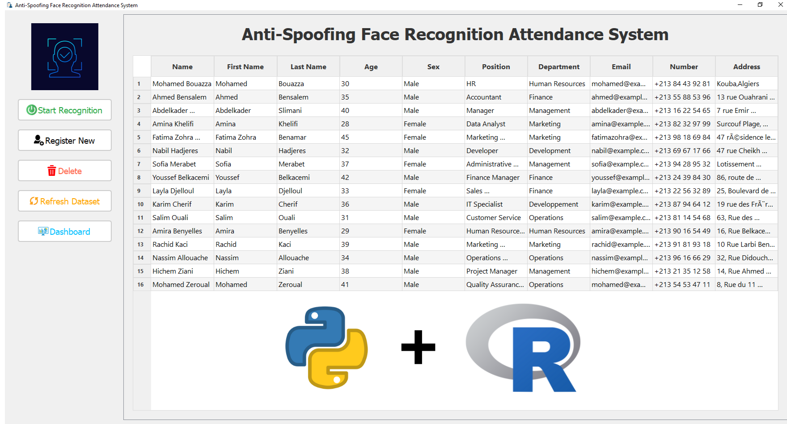
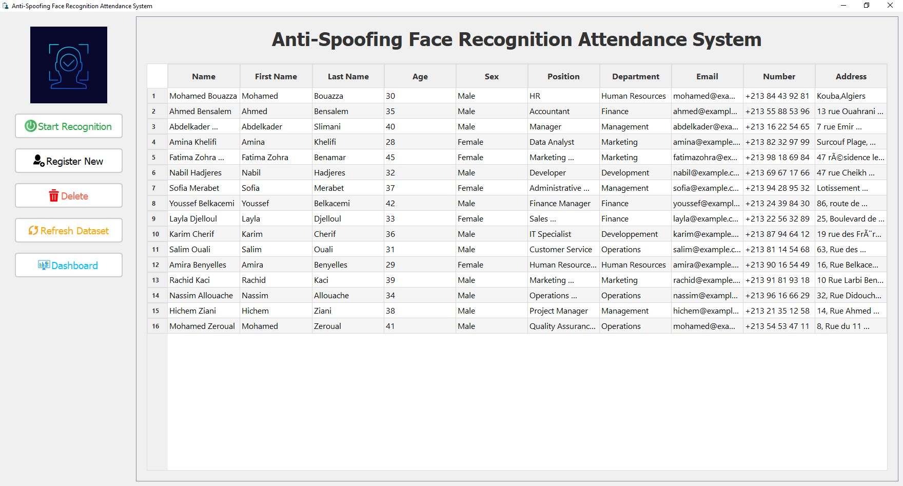
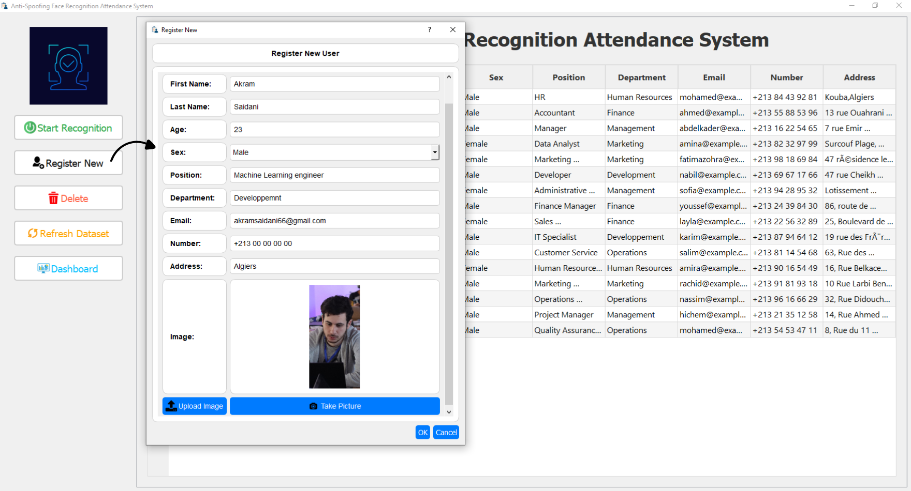
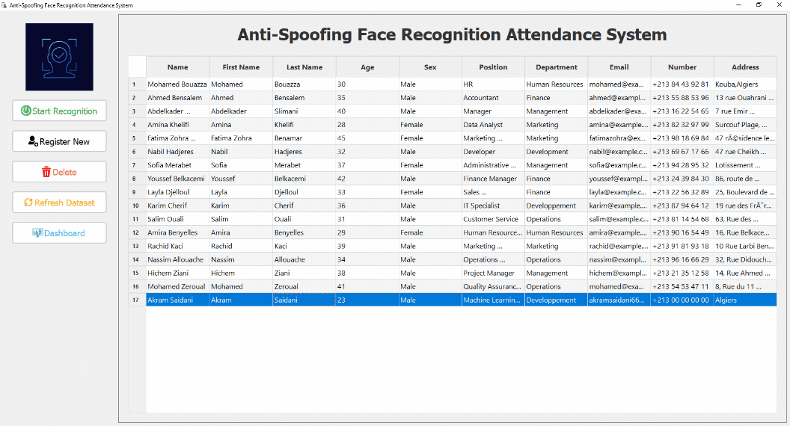
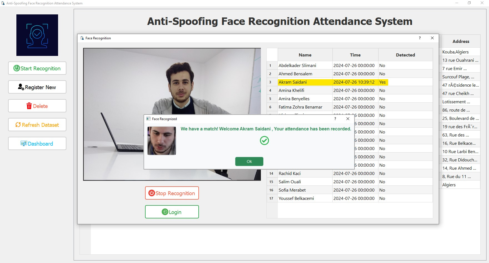
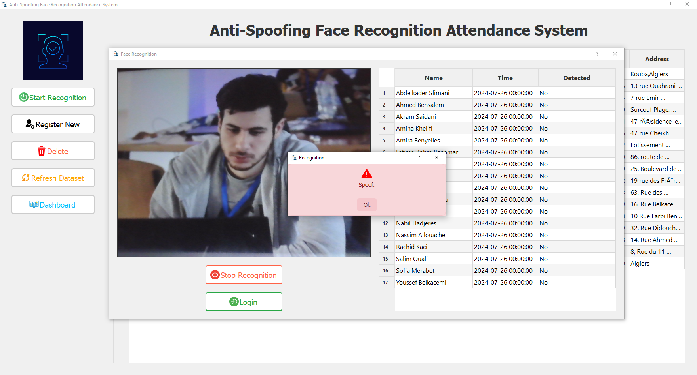
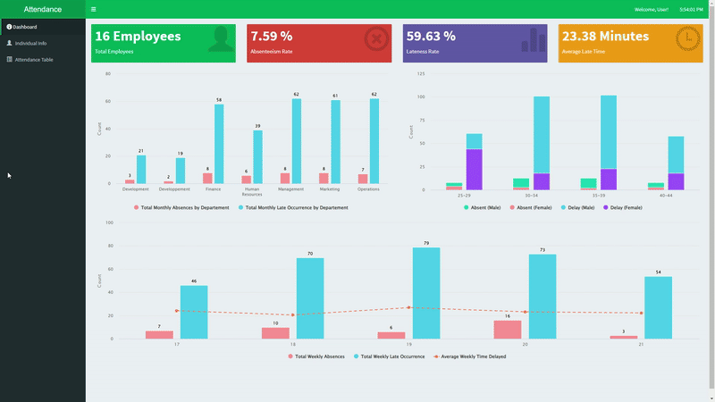
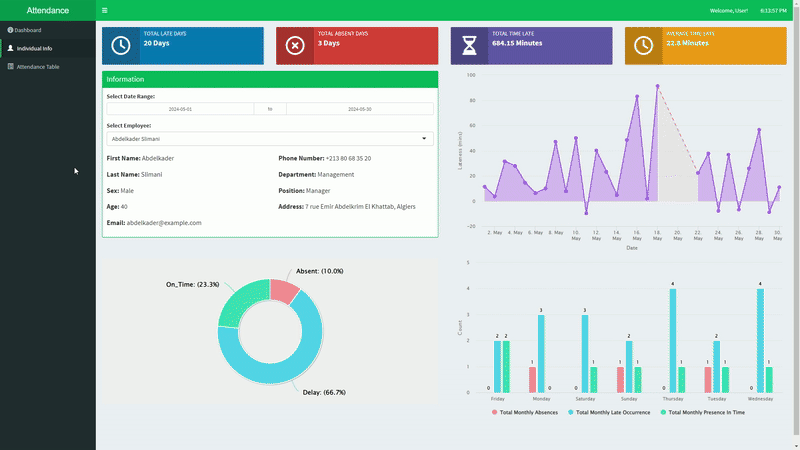

# Anti-Spoofing Face Recognition Attendance System APP

## Overview

The **Anti-Spoofing Face Recognition Attendance System APP** is a hybrid application combining Python and R to provide a robust solution for attendance tracking and data analysis. The system uses advanced face recognition and anti-spoofing techniques to ensure the authenticity of the attendees and provides a user-friendly dashboard for analyzing attendance data.

## Features

- **Face Recognition**: Utilizes InceptionResnetV1 models, pretrained on VGGFace2 and CASIA-Webface datasets. The system also supports other models such as Facenet512 and Human-beings.
- **Anti-Spoofing**: Implements MiniFASNet variants including MiniFASNetV1, MiniFASNetV2, MiniFASNetV1SE, and MiniFASNetV2SE, developed by [Silent-Face-Anti-Spoofing](https://github.com/minivision-ai/Silent-Face-Anti-Spoofing) 
- **User Interface**: Built using `PyQt` for a seamless and interactive experience.
- **Data Analysis Dashboard**: Created with R's `shinydashboard` package to provide insightful analysis of attendance data.

## Main Window

The main window of the App is designed to provide an intuitive interface for managing attendance. It features several key components:

- **Start Recognition**: Initiates the face recognition process to verify and log attendance.
- **Register New**: Allows the user to register new attendees into the system. This uses a one-shot learning technique, so all you need is one clear face image.
- **Delete**: Enables the removal of selected attendees from the database.
- **Refresh Dataset**: Updates the displayed dataset to reflect the most current attendance information. This also allows you to edit information in case of mistakes during Registration process.
- **Dashboard**: Opens the R-based dashboard for detailed data analysis.

The central table displays a comprehensive list of attendees, including details such as name, age, sex, position, department, email, phone number, and address. This layout ensures that administrators can quickly access and manage attendee information.

## Registration Process: Adding a New User

Allows the user to register new attendees into the system using one-shot learning technique, so all you need is one clear face image and full file some personal details. This process ensures that new users are quickly and accurately added to the attendance system.

## Refresh Dateset

Updates the displayed dataset to reflect the most current attendance information and also allows you to edit information in case of mistakes during Registration process.

## Start Recognition

## Spoof Detection

Here I attempted to deceive the model using a picture displayed on my phone and it successfully identified that the image was not a real-time representation (spoof)

# Dashboard for analyzing Attendance Data

By clicking on the Dashboard button, the app executes an R script in the background to process the data, and then it displays the updated dashboard seamlessly

## Main Tab : Overview of the Attendance Data

## Individual Analysis Tab

## Raw Data Tab 

